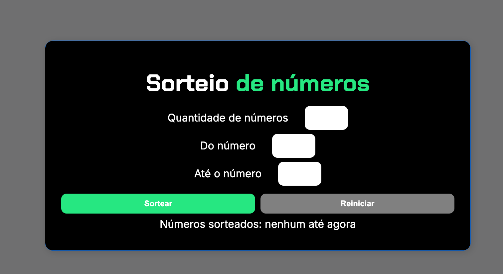

#  Sorteador de Números

Um projeto simples e intuitivo para realizar sorteios de números aleatórios diretamente no navegador.

##  Sobre o Projeto

O Sorteador de Números foi desenvolvido com o objetivo de praticar conceitos de desenvolvimento web e lógica de programação, oferecendo uma interface simples para gerar números aleatórios de forma rápida e eficiente.

##  Funcionalidades

* Sorteio de números aleatórios.
* Interface simples e responsiva.
* Resultado exibido instantaneamente.
* Fácil de usar e sem necessidade de instalação.

##  Demonstração


```md

```

## 🛠️ Tecnologias Utilizadas

* HTML5
* CSS3
* JavaScript

## 📂 Estrutura do Projeto

```bash
sorteador-de-numeros/
├── assets/
│   └── preview.png
├── css/
├── js/
├── index.html
└── README.md
```

## ⚙️ Como Executar

1. Clone este repositório:

```bash
git clone https://github.com/letotecdev/sorteador-de-numeros.git
```

2. Acesse a pasta do projeto:

```bash
cd sorteador-de-numeros
```

3. Abra o arquivo `index.html` em seu navegador.

## 💡 Objetivo

Este projeto foi criado para fins de estudo e prática de desenvolvimento front-end, explorando manipulação do DOM, eventos e geração de números aleatórios com JavaScript.

## 🤝 Contribuições

Contribuições são bem-vindas. Sinta-se à vontade para abrir uma issue ou enviar um pull request.

## 📄 Licença

Este projeto está disponível sob a licença MIT.

---

Desenvolvido por **LetoTec Dev** 🚀
